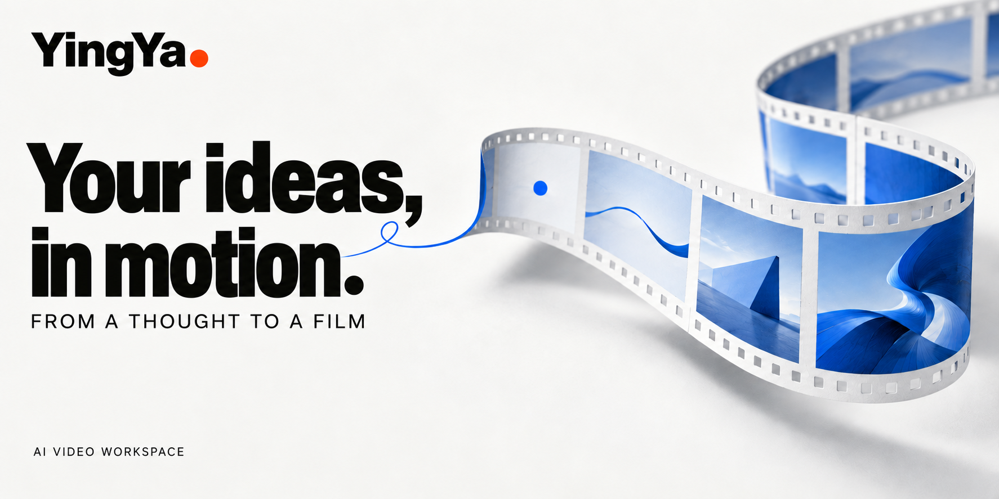
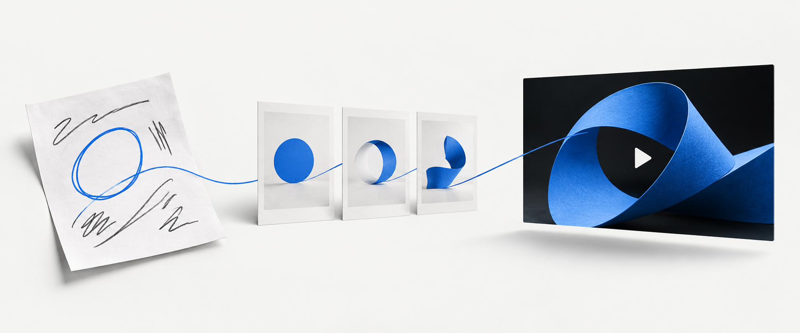

  <a href="README.md">简体中文</a> · <strong>English</strong>

  

  <strong>Talk an idea into a video.</strong> 
  Bring your material. See the frames. Shape the film together.

  <a href="https://yingya.art/app#/">Start creating ↗</a> &nbsp; · &nbsp;
  <a href="https://yingya.art/#style-references">Find inspiration</a> &nbsp; · &nbsp;
  <a href="docs/README.md">Documentation</a> &nbsp; · &nbsp;
  <a href="https://github.com/echonoshy/yingya/issues">Share an idea</a>

## 01 / Give your idea a shape.

YingYa is an AI video workspace. Explain a concept, make sense of data, or introduce a product: start with a few sentences, then add a web page, a reference video, or your own media.

> “Make a short film for students discovering pendulums. Put a long and a short pendulum side by side so the difference in their periods is easy to see.”

**Bring a starting point.** Describe the audience, the message, and your references.

**See the plan first.** Review the outline and keyframes rendered from the actual production source.

**Make the video.** Once you approve the plan, YingYa arranges animation, media, narration, and captions to fit your brief.

## 02 / Now, set it in motion.

15 seconds of form, light, and motion. Click the GIF to watch the original with sound.

- **Explain a concept.** Turn abstract ideas into clear graphics, words, and rhythm.
- **Make data visible.** Use animated charts, comparisons, and annotations to show what matters.
- **Introduce a product.** Bring images, video, and sound together into a complete story.

## 03 / Good work gets another pass.

> “Make the title in scene two bigger. Hold the comparison for two more seconds. Keep everything else.”

Keep refining through conversation, or use screenshots, timestamps, and time ranges to point to a specific moment. Your project, media, and earlier versions stay available. Download an MP4 or share an independent link to the version you choose.

**From the first plan to the next revision, stay in the same creative workspace.**

---

React powers the workspace, Rust runs the backend, the AI Agent interprets the brief and writes and revises the video project, and Remotion handles preview and rendering.

[Product overview](docs/PRODUCT_POSITIONING.md) · [Production workflow](docs/VIDEO_PRODUCTION_WORKFLOW.md) · [Documentation](docs/README.md) · **[Make your first film ↗](https://yingya.art/app#/)**

Most project documentation is currently in Chinese.
