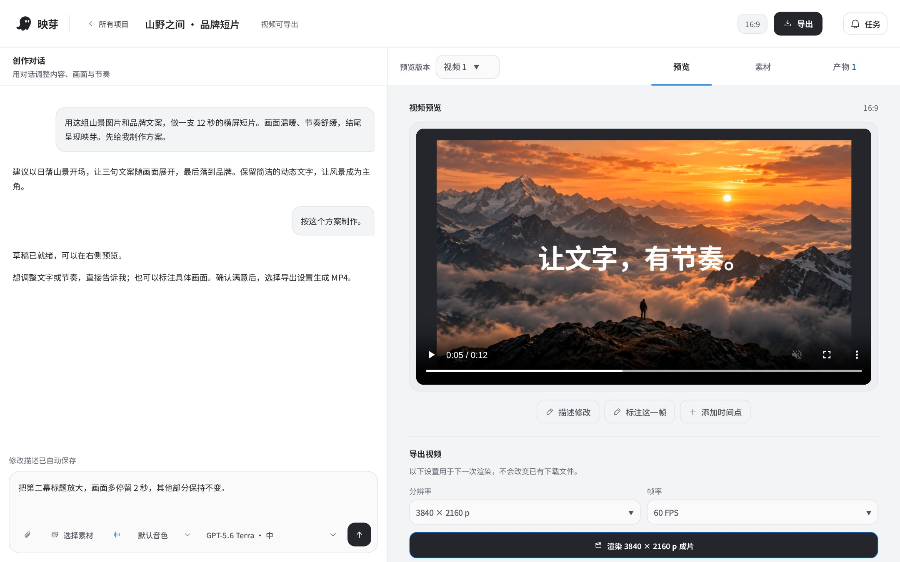

<p align="center"><strong>映芽 · Yingya</strong> 是一个对话式动画视频制作工作台。</p>
<p align="center">把文案、网页和素材做成视频，用对话修改，预览后导出 MP4。</p>

<p align="center">
  <strong>简体中文</strong> · <a href="README.en.md">English</a>
</p>

<p align="center">
  
</p>
<p align="center"><sub>工作台界面 · 使用示例项目数据与映芽原创品牌短片</sub></p>

想直接制作视频，前往 [yingya.art](https://yingya.art/)。
想先看看效果，观看 [66 秒产品演示](https://youtu.be/DuEsvIO0zt4)，或浏览[官网作品](https://yingya.art/#showcase)。
想在自己的服务器运行，按下方说明安装。

---

## 快速开始

### 使用映芽

进入[工作台](https://yingya.art/app)，登录后提供文案、网页、截图或已有素材。映芽适合制作产品演示、知识动画、数据故事和品牌短片。

先确认制作方案，再预览和修改。比如：

> 把第二幕标题放大，画面多停留 2 秒，其他部分保持不变。

满意后导出 MP4。项目与草稿版本会保留，下次可以继续修改。

### 安装与运行

需要 Linux、Rust 1.88+、Node.js 22+、tmux、FFmpeg，以及启用非特权用户命名空间的 Bubblewrap。

```shell
git clone https://github.com/echonoshy/yingya.git
cd yingya
npm ci
cp .env.example .env
```

按[安装指南](docs/DEVELOPMENT.md)配置环境、宿主模型登录和初始账号，再按[服务集成说明](docs/INTEGRATIONS.md)准备 HyperFrames 浏览器。配音、配乐和图像生成依赖相应服务配置。更新已有安装时保留原来的 `.env`。

```shell
npm run web:build
npm run backend:service:start
```

打开 `http://127.0.0.1:8797/app`。后端运行在 tmux 会话 `yingya-backend`，默认端口为 `8797`。

需要频繁更新时，使用[滚动发布流程](docs/ROLLING_UPDATES.md)。API 与用户 Worker 独立运行，当前工作完成后再交接版本；首次从旧单体服务迁移需等待任务结束。

## 文档

- [安装与本地开发](docs/DEVELOPMENT.md)
- [服务集成](docs/INTEGRATIONS.md)
- [视频制作流程](docs/VIDEO_PRODUCTION_WORKFLOW.md)
- [用户沙箱与用量统计](docs/USER_SANDBOX.md)
- [不停机更新与任务恢复](docs/ROLLING_UPDATES.md)
- [全部文档](docs/README.md)

问题与建议欢迎提交到 [GitHub Issues](https://github.com/echonoshy/yingya/issues)。
