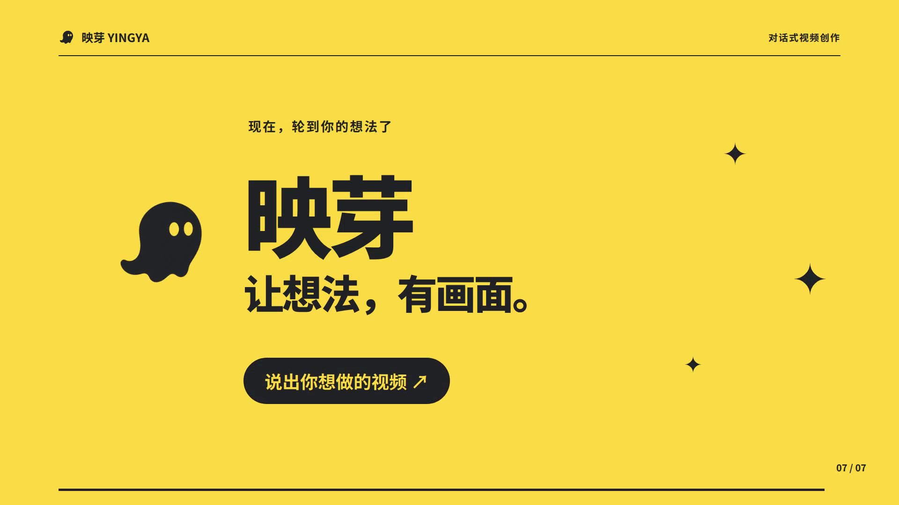

<h1>映芽 · Yingya</h1>

用对话制作动画视频。

  <a href="docs/DEVELOPMENT.md">安装与运行</a> ·
  <a href="docs/INTEGRATIONS.md">服务配置</a> ·
  <a href="docs/README.md">文档</a>

66 秒产品演示 · 川味朋友旁白版 · 点击封面打开 MP4

---

文案 / 网页 / 素材 → 确认方案 → 预览、对话修改 → 导出 MP4

