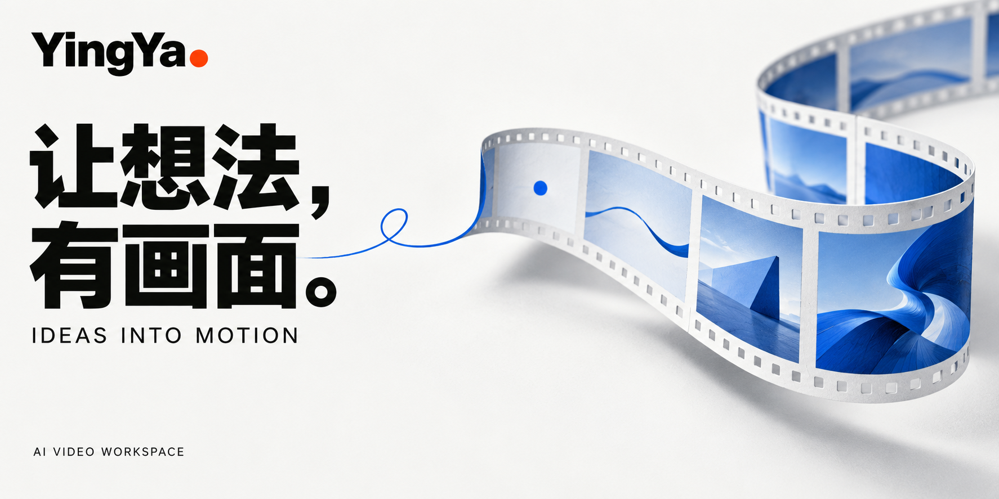

  <strong>简体中文</strong> · <a href="README.en.md">English</a>

  

  <strong>通过对话，把一个想法做成一支视频。</strong> 
  从资料与参考出发，先看画面，再一起打磨成片。

  <a href="https://yingya.art/app#/">开始创作 ↗</a> &nbsp; · &nbsp;
  <a href="https://yingya.art/#style-references">寻找灵感</a> &nbsp; · &nbsp;
  <a href="docs/README.md">项目文档</a> &nbsp; · &nbsp;
  <a href="https://github.com/echonoshy/yingya/issues">聊聊建议</a>

## 01 / 想法，先有个样子。

映芽是一个 AI 视频创作工作台。无论是要讲清一个概念、解释一组数据，还是介绍一个产品，都可以从一段话开始，附上网页、参考视频或自己的素材。

> “给第一次接触单摆的同学做一支短片。把长摆和短摆放在一起，让人一眼看懂周期的区别。”

**给个起点。** 描述观众、内容与参考。

**先看方案。** 在制作前，确认大纲和从实际制作源生成的关键画面。

**再做成片。** 确认后，映芽按要求安排动画、素材、配音和字幕。

## 02 / 然后，让画面动起来。

15 秒，点、线、面、体、光与声。点击 GIF，观看有声原片。

- **讲清一个概念。** 用图形、文字和节奏，把抽象内容讲具体。
- **看懂一组数据。** 用动态图表、比较与标注，突出真正重要的信息。
- **介绍一个产品。** 结合图片、视频和声音，让已有素材成为完整讲述。

## 03 / 好作品，是接着改出来的。

> “第二幕的标题再大一点，比较画面多停留两秒。其他部分保留。”

用自然语言继续修改，也可以通过截图、时间点或时间范围指出具体位置。项目、素材与历史版本会保留；满意后下载 MP4，或分享所选版本的独立链接。

**从第一份方案，到每一次新的修改，都在同一个创作工作台里。**

---

React 构建工作台，Rust 支撑后端，AI Agent 理解内容并编写、修改视频工程，Remotion 负责预览与渲染。

[了解产品](docs/PRODUCT_POSITIONING.md) · [制作流程](docs/VIDEO_PRODUCTION_WORKFLOW.md) · [全部文档](docs/README.md) · **[开始你的第一支片 ↗](https://yingya.art/app#/)**
