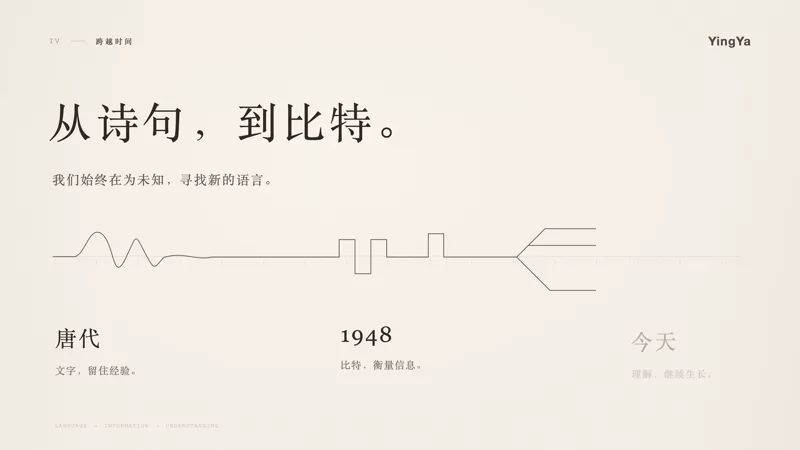
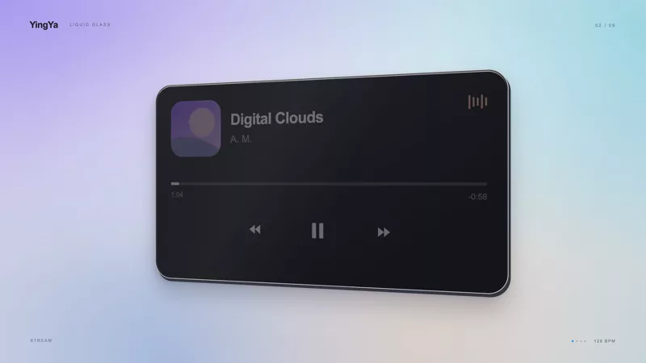
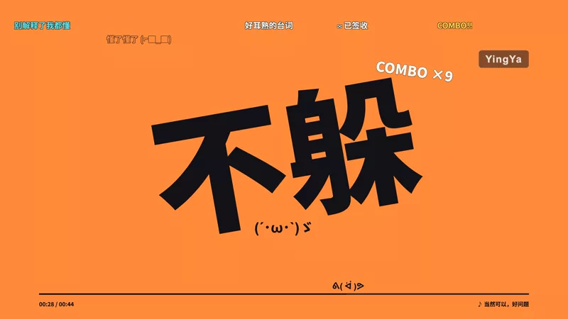

# 映芽 · YingYa

**简体中文** | [English](README.en.md)

**通过对话制作和修改视频。**

映芽是一个 AI 视频创作工作台。从文字、网页、参考视频或自己的素材开始，先确认大纲和关键画面，再制作动画、配音与字幕。通过对话继续修改，最后下载 MP4 或分享视频链接。

[开始创作](https://yingya.art/app#/) · [官网](https://yingya.art/) · [项目文档](docs/README.md)

*15 秒宣传片，点击观看有声版本。*

## 可以做什么内容

- **知识讲解与课程内容。** 把文章、讲稿和问题做成视频，用图形、公式、步骤与对比解释概念。
- **数据与报告。** 根据提供的数据制作动态图表，突出趋势、差异和关键变化，适合业务复盘与调研总结。
- **产品介绍与操作说明。** 结合网页、产品图片和录屏，展示使用场景、功能重点与操作步骤。
- **文字动画与视觉短片。** 用字形、几何图形、粒子和转场制作动态海报、片头、品牌短片与简短故事。
- **已有素材的整理。** 选取上传视频的片段，组合图片与录音，补充解说、字幕和画面。

## 首页视频参考

点击封面观看视频，或到[官网参考区](https://yingya.art/#style-references)选择喜欢的风格，带到自己的创作中。

<table>
  <tr>
    <td width="50%">
       
      <strong>从诗句到比特 · 24 秒</strong> 
      图文讲述：文字、线条与时间顺序。
    </td>
    <td width="50%">
       
      <strong>轻盈的界面 · 30 秒</strong> 
      界面动效：空间层次、元素变化与过渡。
    </td>
  </tr>
  <tr>
    <td width="50%">
       
      <strong>弹幕与节拍 · 45 秒</strong> 
      文字动画：字号、排版与节拍配合。
    </td>
    <td width="50%">
       
      <strong>云间列车 · 18 秒</strong> 
      场景短片：插画构图、色彩与镜头运动。
    </td>
  </tr>
</table>

## 主要功能

- **素材与参考。** 支持网页、剧本、参考图和视频，以及上传的图片、音视频；账户素材库可以跨项目复用。
- **先看方案。** 制作前确认大纲与从实际制作源生成的关键画面，提前调整文案、段落和视觉方向。
- **配音与字幕。** 从文稿生成旁白，或识别已有录音，按实际语音对齐字幕、关键词与画面节奏。
- **准确修改。** 通过对话、截图、时间点或时间范围提出意见，保留历史版本，继续打磨同一个项目。
- **导出与分享。** 下载 MP4，或调整分辨率与帧率后导出。分享所选版本的独立副本，支持免登录观看、有效期设置与取消分享。

## 一次创作怎么进行

提供内容与参考 → 确认大纲和关键画面 → 观看初稿 → 提出修改 → 下载或分享。

例如：

> 把这个产品页面和三张截图做成 30 秒介绍，讲清使用场景和两个核心功能。横屏，中文旁白，附字幕。先给我看大纲和关键画面。

## 项目与文档

前端使用 React，后端使用 Rust；AI Agent 编写和修改视频工程，Remotion 负责预览与渲染。

[产品定位](docs/PRODUCT_POSITIONING.md) · [制作流程](docs/VIDEO_PRODUCTION_WORKFLOW.md) · [视频分享](docs/VIDEO_SHARING.md) · [开发与部署文档](docs/README.md) · [问题与建议](https://github.com/echonoshy/yingya/issues)
