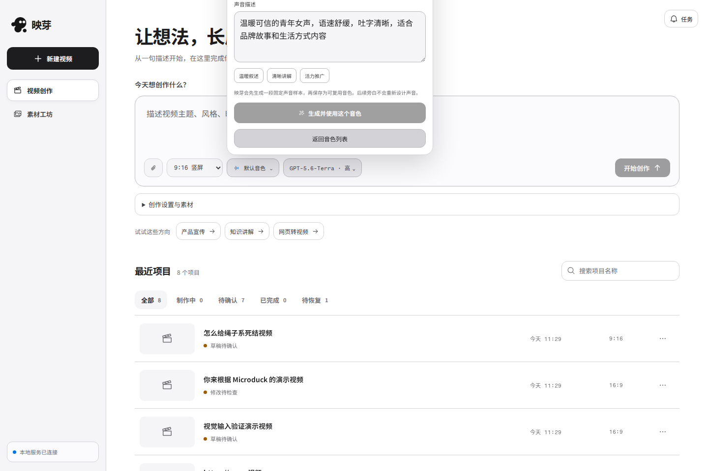
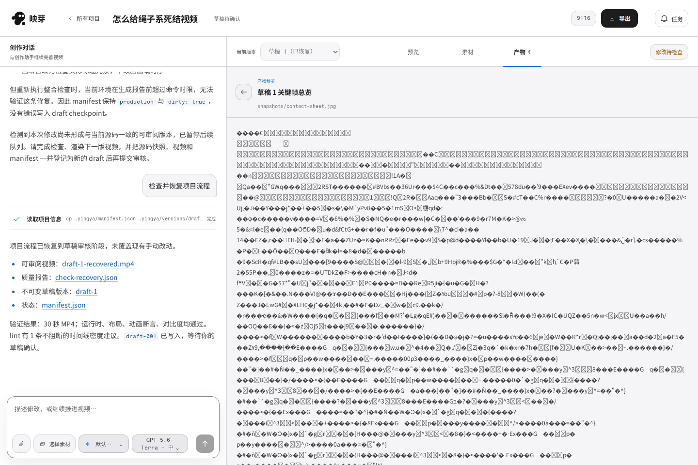
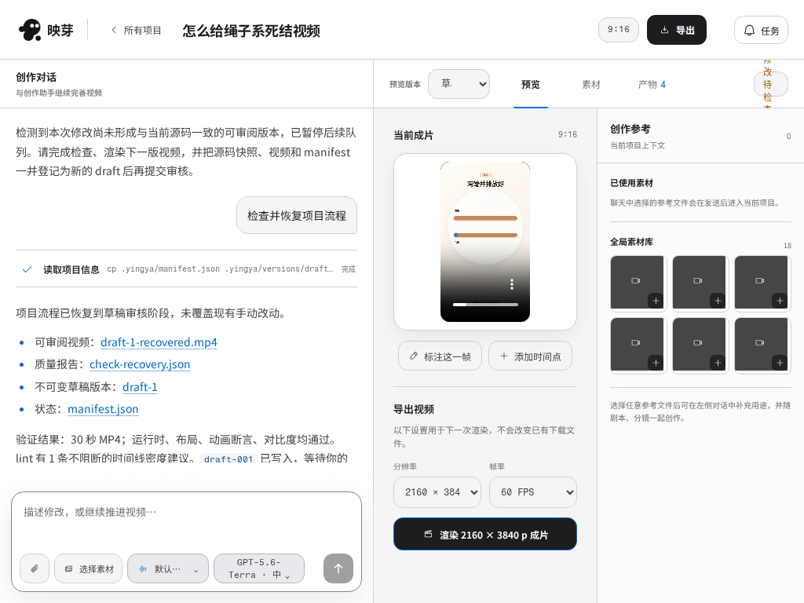
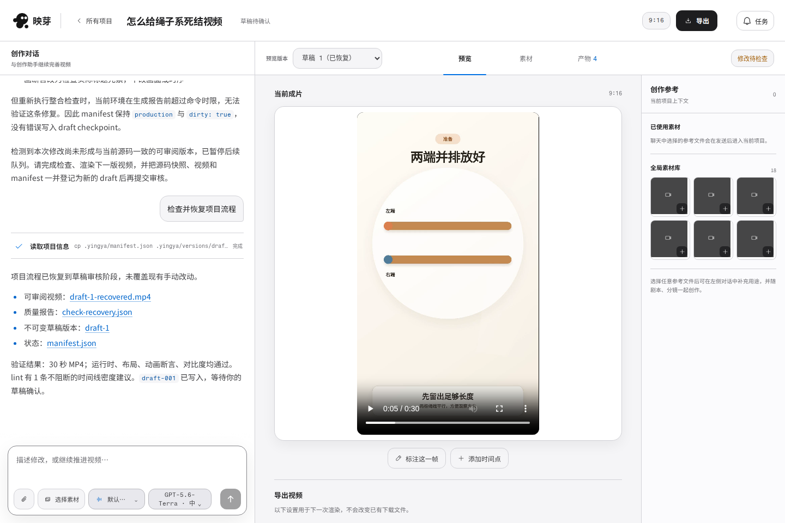
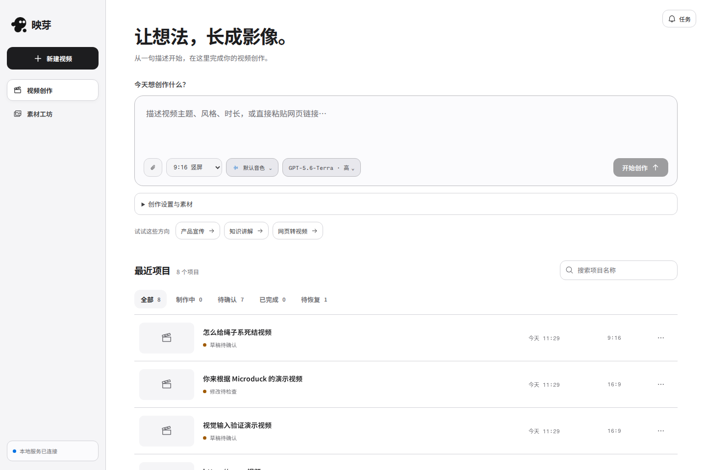

# 映芽完整设计审查与修复计划

审查日期：2026-09-07。代码基线：`a621f65`。状态：**本报告保留修复前的审查证据；实施记录见文末。**

本次覆盖首页、新建配置、模型与音色、方案确认、运行与恢复、视频审阅、画面和时间反馈、产物查看、导出、版本比较、素材管理、任务中心，以及桌面、窄桌面、移动端和键盘操作。依据为仓库 [UI 设计规范](../../UI_DESIGN_STYLE.md)、当前页面截图、交互记录、接口响应与实现代码。

## 结论

映芽已有可用的创作链路，但界面还没有稳定地围绕“理解要求 → 确认方案 → 审阅视频 → 描述修改 → 导出作品”组织。首页缺少作品识别，工作区让技术对话和辅助素材占据较多空间，关键状态和操作分散；一些问题已经影响操作本身。

建议延续现有明亮、克制的设计语言，将产品明确为**作品优先的视频创作台**。优先修复可用性和状态表达，再调整首页、画布和控件层级。换色、增加阴影或装饰不能解决这些问题。

发现 18 项问题：**P1 5 项、P2 10 项、P3 3 项**。P1 表示阻碍关键操作或明显误导核心决策；P2 表示增加明显操作负担、反馈不完整或存在无障碍问题；P3 表示一致性与精修问题。本次未发现需要列为 P0 的问题。

值得保留的部分：画面标注与时间点反馈能进入修改输入区；方案确认保留人工决定；素材支持文件夹与批量管理；已有草稿保存、队列、停止、失败重试和流程恢复；面板调整器支持键盘。应在这些能力上修复，不重新发明整条流程。

## 审查方法与证据边界

- 使用本地 Chromium / Playwright 打开实际应用；本次没有可用的 Browser 插件，沿用用户已授权的本地 Playwright。
- 复用 `yingya-frontend` tmux 会话（8798）与 `yingya-backend`（8797）。既有 UI QA 在 `yingya-design-audit-qa` 会话内运行，测试预览端口 4174 已随测试退出释放。
- 重点视口：1440 × 960、1024 px 宽、390 px 宽、320 px 宽。检查截图、元素边界、焦点、键盘交互、接口失败和减少动效模式。
- 真实数据：已有项目、首页、音色表单、素材库、草稿预览、文件链接、图片产物、画面标注和时间点反馈。未向真实项目发送修改、生成视频、生成音色、执行付费渲染或删除素材。
- 隔离模拟数据：创建中、方案待确认、运行与排队、失败恢复、导出失败与完成、版本比较、首页离线。截图名称带 `mock`；它们验证 UI 状态与交互，不证明真实制作服务成功。
- 自动扫描使用 axe-core 4.10.3，结合人工判断。自动扫描通过不等于完整无障碍合规；目标尺寸需考虑间距例外，未据此直接判定所有小图标违规。
- 本报告只使用本次截图。`evidence/` 保存未编辑的关键截图与部分测量记录；完整脚本、ARIA 快照、扫描结果和原始记录位于本地 `.runtime/ui-design-audit-full-20260907/`。

## 逐步流程审查

| 步骤 | 用户目标 | 结论 | 证据 / 问题 |
| --- | --- | --- | --- |
| 1 | 找回作品或开始创作 | 待优化：输入清晰，项目视觉识别弱 | [首页](evidence/01-home.png)；F10、F18 |
| 2 | 设置画幅、要求、素材 | 待优化：扩展设置拥挤，选择素材以文件名为主 | [创作设置](evidence/02-create-settings.png)；F11 |
| 3 | 选择模型与旁白 | 受阻：桌面音色创建表单越界；模型键盘行为不完整 | [桌面音色](evidence/05-voice-design-fresh.png)、[移动音色](evidence/07-voice-mobile-design.png)；F01、F14、F15 |
| 4 | 阅读并确认方案 | 确认可用，默认画布未呈现当前需要审阅的方案 | [待确认，模拟](evidence/30-plan-review-mock.png)、[方案文档，模拟](evidence/31-plan-document-mock.png)；F12 |
| 5 | 跟随制作、补充要求 | 待优化：运行时输入工具拥挤，状态与排队方式不够清楚 | [桌面运行，模拟](evidence/32-running-queue-mock.png)、[移动运行，模拟](evidence/33-running-mobile-mock.png)；F05、F07 |
| 6 | 从失败或中断恢复 | 已有恢复入口；需统一阶段与画布反馈 | [恢复，模拟](evidence/34-recovery-mock.png)、[真实未完成项目](evidence/47-waiting-brief-real.png)；F05、F12 |
| 7 | 审阅草稿并描述修改 | 标注有效；窄桌面视频过小，移动预览缺通用输入入口 | [桌面草稿](evidence/10-workspace-draft-stable.png)、[1024 px](evidence/18-workspace-1024.png)、[移动预览](evidence/19b-mobile-preview.png)；F04、F13 |
| 8 | 提交画面或时间点反馈 | 核心交互可保留；本次只加入草稿，未发送真实修改 | [画面标注](evidence/13-annotation.png)、[时间点](evidence/15-timed-feedback.png)、[移动标注](evidence/19c-mobile-annotation.png) |
| 9 | 打开视频、图片与文档 | 受阻：对话文件链接跳错页面，图片产物显示乱码 | [产物列表](evidence/16-artifacts.png)、[图片错误](evidence/40-image-artifact.png)、[链接结果](evidence/41-chat-link-destination.png)；F02、F03 |
| 10 | 对比版本并导出 | 待优化：顶部入口不定位导出设置，版本缺修改摘要 | [导出完成与比较，模拟](evidence/39-render-completed-mock.png)、[导出失败，模拟](evidence/38-render-retry-mock.png)；F06、F16 |
| 11 | 查找、分组、选择素材 | 桌面基本可用；移动分类被详情打断，引用查询真实失败 | [素材库](evidence/20-asset-library.png)、[项目素材](evidence/17-project-assets.png)、[移动分类结果](evidence/43-assets-mobile-type-change-stable.png)、[批量模式](evidence/44-assets-mobile-batch.png)；F08、F09、F11 |
| 12 | 管理音色、查看任务与异常 | 基础入口存在；状态图标与文案需精修，离线需继续验收 | [音色工坊](evidence/24-asset-voice-studio.png)、[任务中心](evidence/45-task-center.png)、[离线，模拟](evidence/46-offline-home-mock.png)；F14、F15、F18 |

## 问题清单与修复验收

### F01 · P1 · 桌面浮层超出屏幕，音色创建关键字段无法点击

**复现与影响：** 1440 × 960 首页打开音色，再进入生成音色；表单顶部、名称输入和切换区跑到屏幕外。测得浮层 `y = -204.52 px`、高 `521 px`。模型菜单也出现向上溢出，键盘向下操作还会滚动背景页面。移动音色使用底部固定面板，在本次截图中可完整访问。

**代码证据：** `web/src/styles.css:587` 将 `.voice-menu` 固定向上展开，只限制总高度，没有判断锚点上方可用空间；`web/src/components/ModelSelector.tsx` 的菜单可用高度在渲染时读取位置，未随滚动和窗口变化持续更新。

**修复：** 统一浮层定位与视口碰撞处理；空间不足时翻转方向，保持四边可见，内容区内部滚动。音色的生成与克隆是完整表单，适合复用对话框或抽屉。长表单的标题、关闭和提交区保持可访问。

**验收：** 首页和工作区分别打开模型、音色库、生成、克隆；覆盖顶部/底部锚点、页面滚动、短窗口、1440/1024/390/320 px。所有字段能聚焦与点击；关闭后焦点回到触发器。测量依据见 [voice-desktop-bounds.json](evidence/voice-desktop-bounds.json)。

### F02 · P1 · 对话中的视频链接离开项目并回到首页

**复现与影响：** 在“怎么给绳子系死结视频”的助手消息中点击草稿链接。浏览器把 `/home/lake/workspace/yingya/data/video-projects/…/renders/draft-1-recovered.mp4` 当作应用 URL；实际落到该路径对应的 SPA 首页，没有打开视频，也离开了工作区。

**代码证据：** `web/src/components/MarkdownPreview.tsx:4` 使用默认 Markdown 链接渲染；`AgentWorkspace.tsx:314` 未传入项目文件解析上下文。[实际导航记录](evidence/chat-link-after.json)。

**修复：** 建立带项目上下文的资源链接解析器。已识别、属于当前项目的文件定位到受支持的文件 API 或对应预览器；普通 HTTP 链接保持正常链接行为。项目外路径、未知路径显示可理解的不可用反馈，不能直接开放任意文件系统访问。

**验收：** 点击真实形式的绝对路径、项目相对路径和已有 API 链接，均打开正确文件；覆盖空格、中文、缺失文件、外部 URL。返回后保留当前项目、所选版本和输入草稿。

### F03 · P1 · JPEG 产物被当作文本显示

**复现与影响：** 同一项目进入“产物”，打开“草稿 1 关键帧总览”（`snapshots/contact-sheet.jpg`），右侧出现大量二进制乱码，无法审阅图片。

**代码证据：** `AgentWorkspace.tsx:173` 除视频外全部读取为文本；`:490` 的 `InlineArtifactPreview` 只区分 Markdown 与源码。图片节点数量为 0，见 [记录](evidence/image-artifact-result.json)。

**修复：** 按媒体类型、产物种类和扩展名进行明确分派：图片、视频、音频、Markdown、JSON/文本、其他文件。图片使用图片预览并提供下载，未知二进制提供文件信息和下载。类型冲突或不可读时显示错误；HTML 不直接作为可信页面执行。

**验收：** JPEG/PNG/WebP、MP4、音频、Markdown、JSON、未知二进制分别验证正确预览或回退；损坏与缺失文件有明确提示。切换产物不能出现上一个文件的迟到内容。

### F04 · P1 · 1024 px 工作区把竖屏视频挤到约 114 px 宽

**复现与影响：** 在 1024 px 宽查看竖屏草稿，右侧素材检查器仍占 264 px，对话占据左侧较大空间，视频缩到约 114 px 宽，状态文字竖向换行。页面没有整体横向溢出，但实际内容已不适合审阅。

**代码证据：** `styles.css:1118` 固定检查器宽度；`:1121` 再把竖屏视频限为剩余区域的 `54%`；工作区模式切换断点未覆盖这段拥挤区间。

**修复：** 根据画布实际可用宽度决定是否展示检查器；优先折叠辅助素材。按可用宽高和视频宽高比计算舞台，不再叠加固定百分比。面板拖动到临界宽度时也采用相同行为；标题、版本选择和状态设明确截断/换行规则。

**验收：** 1440、1280、1024、980、800、390、320 px 加上面板拖动。竖屏建议以约 240 px 可审阅宽度作为开始折叠辅助区的设计目标，最终以画布与高度共同约束；不能为了满足数值产生横向滚动。横屏、方形和长标题同样验证。

### F05 · P1 · 制作阶段、版本状态与修改状态混在一起

**复现与影响：** 真实项目顶栏显示“草稿待确认”，画布同时显示“修改待检查”，预览又使用“当前成片”。另一真实项目尚处于收集需求阶段且没有草稿，也被标为“修改待检查”。用户无法据此判断现在应补充需求、检查修改、审阅草稿还是导出。

**代码证据：** `projectState.ts:17` 按执行状态、checkpoint、dirty 排优先级；`AgentWorkspace.tsx:453` 又独立显示 dirty 标签；`src/api.rs:603` 附近为首页摘要单独推导状态。这些字段可能各自有效，但呈现时缺少对象与范围说明。

**修复：** 区分执行状态、制作阶段、当前查看版本、最新有效草稿、源文件是否有未检查修改、导出任务状态。首页、顶栏与画布共用映射规则；每个标签说明它指向任务还是版本。不要通过直接清除 dirty 或隐藏真实警告掩盖冲突。

**验收：** 需求待补充、方案待确认、运行、排队、草稿待审阅、已有草稿但源文件变更、查看旧版本、导出完成、失败与中断均有一致且不误导的主状态与下一步。旧成片仍可下载时，明确说明它对应的版本。

### F06 · P2 · 顶部“导出”没有把用户带到可执行位置

**复现与影响：** 1440 × 960 草稿页点击顶部导出，设置面板仍位于 `y = 880.22 px`、高 `192.5 px`，前后位置完全一致，关键提交区在首屏下方；焦点没有引导用户到那里。[测量](evidence/export-action.json)。

**代码证据：** `AgentWorkspace.tsx:224` 的点击仅切换为预览标签和移动画布。

**修复：** 让导出入口打开独立导出面板，或先用滚动定位加焦点解决不可发现问题。明确本次导出的版本、分辨率、帧率；已有可下载文件和新渲染操作分开说明。已有完成文件的真实规格不能随着用户修改下一次设置而变化。

**验收：** 从对话、素材、产物和不同滚动位置点击导出，设置与主操作立即可见且可聚焦。验证无草稿、排队、渲染中、失败重试、完成下载、旧版本和新版本。现有模拟完成态能够区分已完成规格与新设置，应保留。

### F07 · P2 · 运行时输入工具过度拥挤

**证据与影响：** [运行态模拟](evidence/32-running-queue-mock.png) 中模型名多行换行，排队、停止和发送挤在有限宽度内，发送按钮初始超出对话区。Playwright 在点击试探时自动滚动后可触达按钮，因此这里不判为发送功能失效，而是默认布局与可发现性问题。

**代码证据：** `AgentWorkspace.tsx:247` 在同一工具行叠加所有操作；`styles.css:210` 及工作区覆盖规则。排队使用未勾选复选框表示默认排队，勾选后标签变为“立即应用”，当前模式不够直接。

**修复：** 保持输入、发送/停止和当前发送模式稳定可见；模型、音色等低频配置放入紧凑设置区。以明确的二选一模式表达“排队执行 / 立即应用”，说明后者对当前任务的影响。

**验收：** 多种模型长名称、运行/停止中/上传/发送失败/有队列组合下，发送和停止无需横向滚动；显示模式与提交参数一致，不改变中文输入法和快捷键行为。

### F08 · P2 · 移动端切换素材分类会意外打开详情

**复现与影响：** 390 px 全新打开素材工坊，点击“视频”分类，页面立即被第一个视频的全屏详情覆盖。用户想筛选素材，却被带入某个文件。[分类前](evidence/42-assets-mobile-fresh.png) → [分类后](evidence/43-assets-mobile-type-change-stable.png)。

**代码证据：** `AssetStudio.tsx:247` 的 `chooseTab` 对非音色分类无条件设置 `inspectorOpen(true)`。

**修复：** 分类只更新列表；点击具体素材才打开移动详情。桌面可以保留旁侧检查器，但不得把这个状态机械复用到移动模态层。批量选择期间不自动弹详情。

**验收：** 390/320 px 切换全部、图片、视频、音频与文件夹，列表保留可见；点卡片进入详情，关闭回到原筛选与滚动位置；横竖屏切换与批量模式同样验证。

### F09 · P2 · 素材使用位置查询失败，却仍显示数量 0

**复现与影响：** 真实素材库出现“使用位置暂时无法读取，请重新选择素材重试”，同一区域显示 `0`，没有直接重试按钮。[界面](evidence/20-asset-library.png)。请求 `/api/assets/library/…/usage` 返回 HTTP 500，错误为 ``missing field `name` at line 2 column 141``。

**代码证据：** `src/api.rs:3790` 的使用位置查询遍历项目，任一项目的媒体读取错误会终止整个请求；`AssetStudio.tsx:284` 在错误时仍展示默认空数组长度。由响应和代码推断可能涉及历史项目媒体格式兼容；本次没有定位并修改具体数据文件。

**修复：** 前端区分加载中、已知 0、已有引用、未知/失败，并提供直接重试。后端调查数据兼容与迁移；若支持部分结果，必须明确标记结果不完整，不能把读取失败静默当成未使用。

**验收：** 正常无引用、有引用、单项目数据异常、请求失败与重试成功。失败时不显示确定的“0 个使用位置”，也不能据此让用户误判可删除。

### F10 · P2 · 首页缺少作品识别，视频产品属性不明显

**观察与影响：** 最近项目主要是相同的场记板占位块和文字行；已有视频难以凭画面识别。输入区占据较多首屏空间，回访用户的作品信息密度偏低。

**代码证据：** `App.tsx:103` 起仅从前 12 个项目的媒体列表找第一张图片作为封面，未使用草稿视频海报；读取失败也退回通用占位。不是简单调整卡片圆角就能修好封面。

**修复：** 建立封面优先级：最新有效草稿海报 → 有意义的项目参考图 → 无图占位。由明确元数据/API 提供，不在首页同时加载大量完整视频。保持新建输入为明确主入口，同时让最近作品更早进入视野；可采用带封面的紧凑卡片或增强列表，先保证真实内容。

**验收：** 有草稿、只有图片、纯文本、加载失败、封面更新、超过 12 项等情况；搜索与筛选后封面对应正确项目；不因封面增加明显加载成本。此项视觉判断置信度高，最终布局偏好仍需实际使用反馈。

### F11 · P2 · 创作配置与素材选择缺少统一层级

**观察与影响：** [展开创作设置](evidence/02-create-settings.png) 后，表单和素材复选列表拉长页面。视频/图片参考主要靠文件名识别；首页、输入区、右侧参考区和素材工坊的选择方式分散。

**代码证据：** `CreationSettings.tsx:24`、`App.tsx:184`、`AgentWorkspace.tsx:247` 及项目素材区域。

**修复：** 常用配置保留画幅、时长与旁白；目标受众、风格等按创作需要展开，模型与思考深度归入高级设置。复用带缩略图、文件夹、搜索和已选预览的素材选择器，明确“全局素材”和“本项目已用素材”。

**验收：** 页面切换和失败重试保留文本、附件、设置与已选素材；选中/取消动作即时明确；长名称、有同名文件、空文件夹、移动宽度均可使用。

### F12 · P2 · 画布与对话没有围绕当前阶段组织信息

**观察与影响：** 真实对话暴露大量路径、manifest 和检查细节；方案待确认时，默认画布仍是大型空视频舞台，需要再次点击才看到方案。无草稿提示提到不在当前标签中的“实时画面”和 HTML 动效，缺少当前阶段的下一步。真实未完成项目还出现网络恢复提示，本次只记录其出现，不将其原因归为视觉代码。

**修复：** 按阶段决定默认主要内容：需求摘要、方案文档、制作预览、草稿视频。助手结果优先呈现“做了什么、可查看的作品、需要你决定什么”，技术执行明细可展开。逐步增加结构化结果字段；历史消息保持可访问，不用简单正则删掉重要错误或修改事实。

**验收：** 每个阶段首屏能回答“现在在做什么 / 我接下来做什么”；真正有实时画面时才给对应入口；状态卡不重复要求已经完成的确认。保留对话修改、时间点和画面标注，不增加独立分镜编辑器。

### F13 · P2 · 移动预览缺少直接描述修改的入口

**复现与影响：** [移动预览](evidence/19b-mobile-preview.png) 可播放和添加标注，但没有通用修改文本框；用户要切回对话才能描述整体变化。添加画面标注后自动回到输入区是有效衔接，应保留。

**修复：** 在预览保留“描述修改”入口，展开轻量输入层或底部输入区，并带入当前版本；画面与时间反馈仍能一起提交。避免永久占据过多视频高度。

**验收：** 390/320 px 可从预览开始修改；打开/关闭输入、切换标签和恢复草稿不丢内容；补做真机虚拟键盘、安全区、旋转屏幕验证。本次桌面模拟不能代替这些检查。

### F14 · P2 · 小字号和部分文字对比度不足

**证据：** axe 与样式核对发现 `#6e6e73` 在 `#f1f1f4` 上约为 4.49:1，出现在部分 10–11 px 次要文字；`#0071e3` 在 `#f5f5f7` 上约为 4.31:1，出现在部分实时/导出状态文字。另有 9–10 px 元数据低于仓库建议的 11–12 px。

**依据与范围：** 普通文字 AA 要求至少 4.5:1，4.49 不能向上取整判通过；禁用控件有例外，本报告未将其计入。见 [W3C 文字对比度说明](https://www.w3.org/WAI/WCAG22/Understanding/contrast-minimum.html)。

**修复：** 按“文字 token × 所在表面”校准组合；必要时增加语义化的强调文字 token，保留蓝色交互含义，避免零散补色。正文维持规范的 14–17 px，元数据一般 11–12 px，关键动作不靠极小字塞入。

**验收：** 所有实际表面上的正常、悬停、选中、错误与运行文字达到对应要求；200% 缩放和长中文内容仍可操作。小目标需结合间距按 [W3C 目标尺寸规则](https://www.w3.org/WAI/WCAG22/Understanding/target-size-minimum.html) 判断，不能只看宽高。

### F15 · P2 · 模型菜单键盘行为和部分语义不完整

**复现与影响：** 聚焦模型触发器并按 Enter 打开，焦点仍在触发器；按 ArrowDown 没有进入菜单，背景页面滚动。Escape 可以关闭并返回触发器。[记录](evidence/model-keyboard.json)。

**代码证据：** `ModelSelector.tsx` 声明 `role="menu"`，未实现配套方向键/选项焦点行为。axe 还报告通用 div 上不允许的命名方式（`AgentWorkspace.tsx:265` 的已选素材容器）、部分重复/缺少名称的地标和标题层级问题。地标最佳实践提示与确定的交互问题应区别处理。

**修复：** 使用与选择任务相符的原生控件或完整可访问选择模式；若保留 menu，补齐打开后焦点、方向键、选中状态和 Escape。弹层、标签页、对话框分别采用正确语义，避免只添加 role 而缺少行为。参考 [W3C 菜单按钮模式](https://www.w3.org/WAI/ARIA/apg/patterns/menu-button/)。

**验收：** 仅键盘完成模型/深度选择、音色切换、产物切换、打开/关闭对话框；焦点可见且回归合理；移动隐藏面板不留可聚焦控件。重新运行 axe，并人工验证辅助技术朗读；后者本次尚未完成。

### F16 · P3 · 版本比较承诺“修改说明”，却没有修改摘要

**观察：** [完成态模拟](evidence/39-render-completed-mock.png) 的比较区域可展示两个版本、日期和视频；“比较版本与修改说明”下没有实际修改说明。

**代码证据：** `VersionComparison.tsx:10` 仅渲染版本名称、时间、视频和检查报告。

**修复：** 使用可验证的版本变更摘要，关联用户修改要求与结果；没有摘要时明确说明，或先改为“比较版本”。之后再评估同步播放，避免为视觉改版先做完整视频编辑器。

**验收：** 有/无摘要、无视频的版本、同名版本、旧版本反馈均不混淆；当前查看版本与下载版本明确。

### F17 · P3 · 布局规范、组件实际数量与 CSS 覆盖存在漂移

**证据：** `styles.css:1112` 桌面画布三个标签仍使用四列网格；`:1209` 移动四个标签使用五列网格。样式中存在多轮覆盖，同一组件的最终结果难以从单一规则理解。规范中“项目导航 / 对话 / 画布”的默认三栏与现有“对话 / 视频 / 创作参考”不一致。

**修复：** 先确认本报告建议的作品优先布局，再更新规范；按实际标签数量分配空间。整合受影响组件的布局规则和 token，统一按钮、输入、标签、间距及选中态，不做无边界的全量 CSS 重写。

**验收：** 去掉不必要的空列；模式切换、容器调整与长文案表现一致。明确单一生效规则，保留现有减少动效、焦点和响应式行为。

### F18 · P3 · 产品文案与状态图标仍偏技术管理界面

**观察：** “产物”“检查点”“Composition”等术语与普通创作决策混排；[任务中心](evidence/45-task-center.png) 中不同待处理情形大量使用相同的警告形态，审阅、失败和恢复之间区分有限。“当前成片”也需要与草稿/导出状态一致。

**修复：** 优先使用结果和动作名称，如“制作方案”“项目文件”“查看草稿”“确认并制作”“导出视频”。技术名称在用户需要选择模型、检查文件或排查问题时保留。审阅、运行、成功和失败使用现有 Phosphor 图标与文字共同表达，沿用语义色。

**验收：** 术语表与状态映射同步；同一对象跨首页、工作区、任务中心名称一致；不依赖颜色传达状态，不引入 emoji、装饰性 Agent 元素或拟人文案。

## 建议采用的界面结构

### 首页：开始创作 + 可识别的最近作品

保持映芽名称与现有品牌资产。主输入保留“描述视频”的明确用途，常用参数集中在输入附近；高级配置折叠。最近作品以真实封面、名称、制作状态与最近更新时间构成稳定单元，主要操作为打开继续创作。任务中心承载跨项目运行情况，不把首页做成技术监控面板。

### 工作区：视频与当前决定优先

桌面保留对话与作品画布；素材检查器按空间和用户需要展开。不要为了保留固定三栏牺牲视频。输入与当前任务摘要在运行时可找到，技术输出默认收拢。顶栏只承载项目身份、清楚的主状态与导出入口；版本信息靠近视频，文件状态靠近对应文件。

| 阶段 | 画布主要内容 | 主行动 | 辅助信息 |
| --- | --- | --- | --- |
| 需求待补充 | 已知要求与待补问题 | 补充要求 | 参考素材 |
| 方案待确认 | 当前制作方案文档 | 确认并制作 / 描述修改 | 文件与执行详情 |
| 制作中 | 可用的实时画面或最后有效草稿 | 继续输入，明确排队方式 | 当前动作、停止、队列 |
| 草稿审阅 | 当前所选版本的视频 | 描述修改 / 导出 | 时间点、画面标注、版本比较 |
| 导出中/完成 | 对应版本与渲染状态 | 完成后下载 / 失败后重试 | 实际规格与历史成片 |
| 失败/待恢复 | 保留有效成果与具体原因 | 检查并恢复 / 补充信息 | 技术详情 |

此表是修复设计目标，不是已经实现的行为。具体判断应基于真实数据字段，不能伪造制作进度或将不同阶段压成一个百分比。

### 移动端：预览、反馈和输入保持连续

保留明确标签切换，预览页提供直接描述修改的入口。素材类别保持列表语义，详情才使用全屏层。音色与复杂设置采用有边界的面板。针对虚拟键盘和安全区设计输入层，避免仅以桌面浏览器缩窄通过验收。

### 视觉系统：校准现有规范

继续使用白色工作面、冷灰导航/检查器、近黑主操作与系统蓝焦点/选中/实时状态。复用现有语义 token、Phosphor 图标、12 px 控件圆角、18 px 主要容器圆角与既有动效时长。优先调整字号、对齐、间距和内容密度；只在浮层使用阴影。蓝色文字与所在底色的对比度需单独校准。

## 分批实施清单

每一批应能独立审阅并验收。工作量按代码影响范围定性描述，不是排期承诺。

| 批次 | 工作包 | 对应问题 | 主要交付 | 影响范围 |
| --- | --- | --- | --- | --- |
| A1 | 文件打开与媒体预览 | F02、F03 | 项目资源解析、按类型预览、失败回退及真实形式链接测试 | 中：消息、画布、文件 API 使用 |
| A2 | 浮层与键盘 | F01、F15 | 可见边界、完整焦点行为、音色表单容器 | 中：共享交互组件 |
| A3 | 工作区空间分配 | F04、F07、F08、F13 | 1024 px 可审阅、稳定发送区、移动分类与修改入口 | 中：布局及移动交互 |
| B1 | 状态与导出闭环 | F05、F06、F09 | 共用状态映射、明确导出入口、引用查询错误处理 | 中至大：前后端状态契约 |
| B2 | 首页与素材选择 | F10、F11 | 草稿海报元数据、作品展示、统一素材选择器 | 中：数据与视觉共同调整 |
| C1 | 阶段信息与视觉统一 | F12、F14、F16、F17、F18 | 阶段画布、结果摘要、文字 token、版本说明、文案和规范同步 | 中：分组件逐步完成 |

先完成 A1/A2/A3 和 B1 中的状态歧义，再展开首页整体改版；封面所需数据可先定义。F18 的草稿/成片措辞必须随 B1 一起修正，不能等待最后润色。前几批完成后已有明确的体验收益，无需等待一次全站大改。

## 回归与交付门槛

| 验收面 | 必须验证的结果 |
| --- | --- |
| 真实文件 | 对话链接、图片总览、视频、音频、文本、未知类型、缺失文件均正确处理；不落回 SPA 首页 |
| 浮层 | 首页/工作区、顶部/底部锚点、短窗口、滚动后打开、长音色表单，字段与主操作始终可触达 |
| 状态 | 需求、方案、运行、队列、旧草稿、未检查修改、导出、失败/中断状态矩阵一致 |
| 输入连续性 | 中文输入法、附件、已选素材、时间点、画面标注、刷新恢复、发送失败和重试不丢内容 |
| 响应式 | 1440/1280/1024/980/800/390/320 px；面板拖动；横/竖/方形视频；长模型名与标题 |
| 移动 | 预览开始修改、分类不弹详情、批量选择、关闭返回、真机键盘与安全区 |
| 导出 | 入口可发现；版本与规格正确；无视频、运行中、失败、完成、已有文件与新渲染分别验证 |
| 无障碍 | 键盘完整路径、焦点回归、可访问名称/状态、文字对比度、缩放、减少动效；补充读屏人工检查 |
| 性能 | 首页封面不拉取大量完整视频；媒体和复杂预览按需加载 |
| 设计一致性 | 按 UI 规范检查白/灰层级、正文与元数据字号、语义色、间距、图标和文案 |

本次已执行 `npm run typecheck`、`npm run web:build`、`node tests/ui-qa.mjs`，均通过。构建有主包体积提示，非本次阻塞项。既有 UI QA 包含草稿保存、任务、反馈、音频、版本比较、素材/文件夹、动效与移动流程，见 [测试日志](evidence/baseline-ui.log)。这些测试通过，仍未覆盖本次真实路径、JPEG 和部分宽度问题，因此不能以现有全绿替代新增回归。

本次未完成真实视频生成到最终导出的端到端服务验证、真实移动设备键盘测试、完整读屏测试或用户研究。模拟截图中的实时媒体占位、网络生命周期不用于认定生产服务故障；视觉与信息架构建议是基于当前任务流程的专业判断，后续应观察首次创作与回访审阅是否更顺畅。

## 实施记录（2026-09-07）

本次按照审查计划落地了以下修复；上文截图与测量保留为修复前基线。

| 问题 | 已实施的变化 |
| --- | --- |
| F01、F15 | 音色改用原生模态对话框；模型菜单根据锚点和视口定位，补齐方向键、焦点与单选语义；修复已选素材与导出区的可访问语义 |
| F02、F03 | 项目文件链接统一解析到文件 API；图片、视频、音频、文本分别预览，未知文件提供下载与错误回退 |
| F04、F07、F13 | 根据画布容器宽度折叠素材检查器，竖屏按实际宽高适配；稳定发送/停止工具区；明确排队或中断执行；移动预览增加描述修改入口 |
| F05、F06 | 区分需求阶段、草稿审阅、源文件更新与已导出视频；避免跨版本回退到错误视频；导出入口滚动定位并聚焦设置，无草稿时给出说明 |
| F08、F09 | 移动素材分类不自动打开详情；引用查询有加载、未知、重试状态；兼容旧项目的素材路径与缺省元数据，读取不重写原文件 |
| F10、F11 | 最近作品改为封面展示；草稿封面由后端生成并缓存；首页与对话共用带缩略图、搜索、文件夹和已选数量的素材选择器 |
| F12、F18 | 方案阶段直接显示制作方案；技术代码块折叠；视频 Agent 回复规范优先说明作品、修改与下一步；调整文件与草稿文案、待审阅任务图标 |
| F14、F17 | 校准次要文字与强调文字 token，提高过小元数据字号；修正标签数量对应的网格；同步产品布局规范 |
| F16 | 比较入口改为准确的“比较版本”，避免承诺尚未存在的修改说明。自动版本摘要与同步播放不在本轮新增范围 |

新增回归覆盖项目文件路径、媒体类型、工作流标签、旧素材兼容，以及桌面音色、键盘模型选择、图片预览、导出焦点、1024 px 竖屏、移动修改入口和素材分类。原有草稿、队列、恢复、版本、素材与动效检查继续保留。截图与临时验证日志保存在本机 `/tmp/yingya-design-fix/`，不加入产品构建。

本轮不触发真实视频或音色生成。真实渲染服务的端到端结果、真机虚拟键盘与读屏体验仍需要各自专门验证；浏览器模拟状态与自动扫描不替代这些验证。
